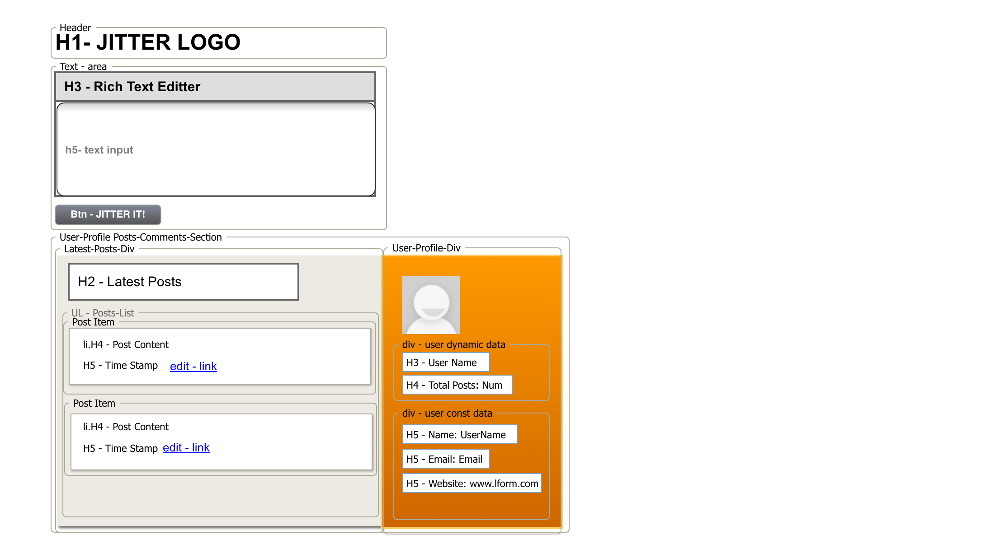
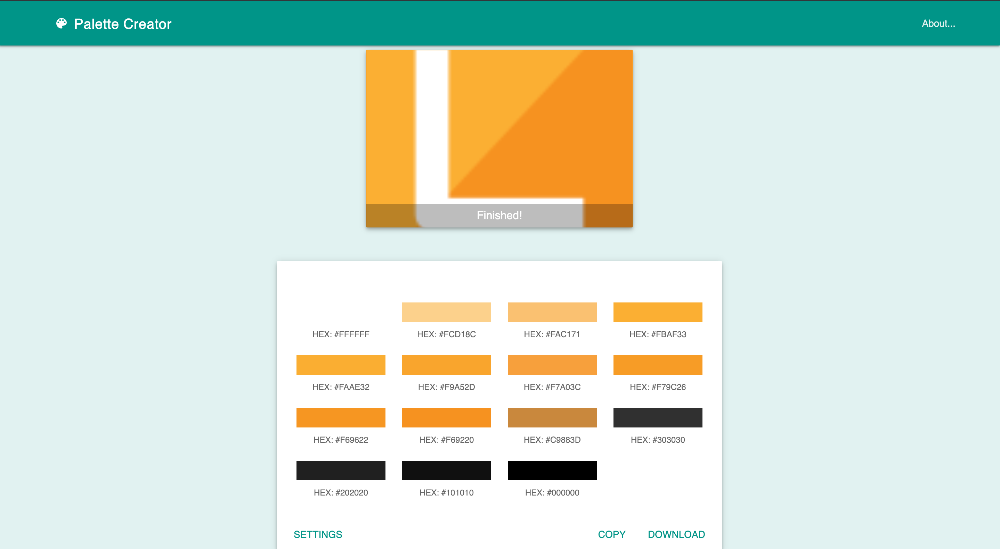

# **Jitter-It**

a Node, Express, and MySQL powered twitter like post application. The user will have the ability to create, read, and edit posts from a MySQL database. [Jitter-It Website](https://shielded-escarpment-57780.herokuapp.com/)

---

# **Technologies and Depencies**

This application implements a simple twitter like posts page. It uses the `MySQL` database backend together with these `npm packages`:
> - `MySql` - In order to run this application, you should have the MySQL database already set up on your machine. If you don't, visit the [MySQL installation page](https://dev.mysql.com/doc/refman/5.6/en/installing.html) to install the version you need for your operating system. Once you have MySQL installed, you will be able to create the *jitter-it* database as well as the *seeds* for the table. You will find the SQL code for schema in the database folder under name [schema.sql](database/schema.sql), the seeds can be found in database folder under name [seeds.sql](database/seeds.sql) . Run this code inside your MySQL client like [MySQL Workbench](https://www.mysql.com/products/workbench/) to populate the database, then you will be ready to proceed with running the app.
> - `Express` - to mount server. 
> - `dotenv` - to protect passwords and sensitive data.
> - `path` -  path npm package. 

The site runs in Node, the server side code is written in `javascript` implementing features of of ES6.

Front-End is built using
> - `html5` 
> - `css3` 
> - `ES6` 
> - `JQuery` 
> - `AJAX`
> - `ckEditor` 
> - `Google Fonts`
# **initial wireframe**

# **color palette**

MIT © [Vanessa de la Cuetara](2019)
