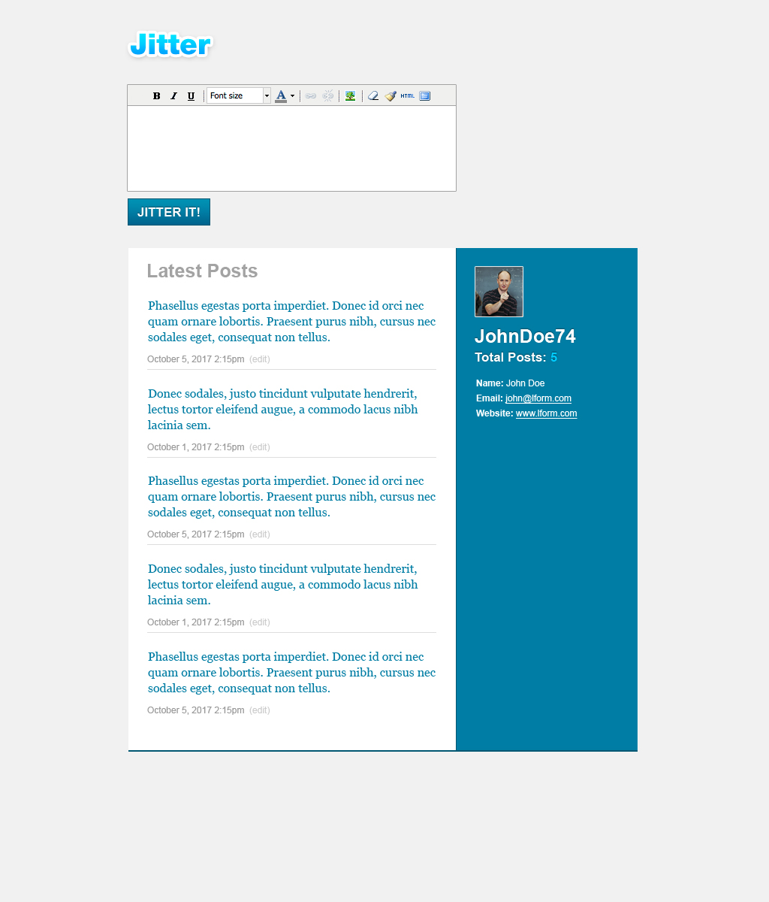

# **Jitter-It**

a Node, Express, and MySQL powered twitter like post application. The user will have the ability to create, read, and edit posts from a MySQL database. [Jitter-It Website](https://shielded-escarpment-57780.herokuapp.com/)

---

# **Technologies and Depencies**

This application implements a simple twitter like posts page. It uses the `MySQL` database backend together with these `npm packages`:
> - `MySql` - In order to run this application, you should have the MySQL database already set up on your machine. If you don't, visit the [MySQL installation page](https://dev.mysql.com/doc/refman/5.6/en/installing.html) to install the version you need for your operating system. Once you have MySQL installed, you will be able to create the *jitter-it* database as well as the *seeds* for the table. You will find the SQL code for schema in the database folder under name [schema.sql](database/schema.sql), the seeds can be found in database folder under name [seeds.sql](database/seeds.sql) . Run this code inside your MySQL client like [MySQL Workbench](https://www.mysql.com/products/workbench/) to populate the database, then you will be ready to proceed with running the app.
> - `Express` - to mount server. 
> - `dotenv` - to protect passwords and sensitive data.
> - `path` -  path npm package. 

The site runs in Node, the server side code is written in `javascript` implementing features of of ES6.

Front-End is built using
> - `html5` 
> - `css3` 
> - `ES6` 
> - `JQuery` 
> - `AJAX`
> - `ckEditor` 
> - `Google Fonts`

# **template for challenge**

# **initial wireframe**

# **color palette**

# **Instructions**
# Lform Developer Test

You will be creating a small webapp call Jitter, this test will gauge your knowledge of basic HTML, CSS, MySQL, and PHP. Jitter is essentially Twitter, a micro-blogging mechanism, except Jitter will allow the user to edit their posts. It should take approximately 1 — 2 hours to complete, however you should focus on organization, clean code and best practices rather than quickness of development.

## Specifications

1. The resulting HTML/CSS version of the design must resemble the design reference as close as possible and work on all major browsers (Safari, Chrome, Firefox, IE 11, Edge).
1. PHP should be object oriented.
1. Do not use any frameworks.
1. Create a simple MySQL database to store the posts.
1. Posts will be added/updated by clicking the 'Jitter It' button.
1. If the 'edit' link is clicked, the contents of that post should appear in the Jitter text box and when submitted, update that post.
1. The 'Total Posts' line should reflect the total number of posts in the posts table.
1. Integrate a rich text editor (such as TinyMCE or CKEditor) for the Jitter textarea, it should contain the following buttons: bold, italic, underline, font size, font color, link, unlink, insert image, remove style formatting, clean up code, HTML view, full screen. Configure it as it appears in the design example.
1. Once you have completed the test, create a dump of the MySQL database and include it in a zipfile containing all the Jitter site files required to run the site and mail it to [updates@lform.com](mailto:updates@lform.com).

MIT © [Vanessa de la Cuetara](2019)
